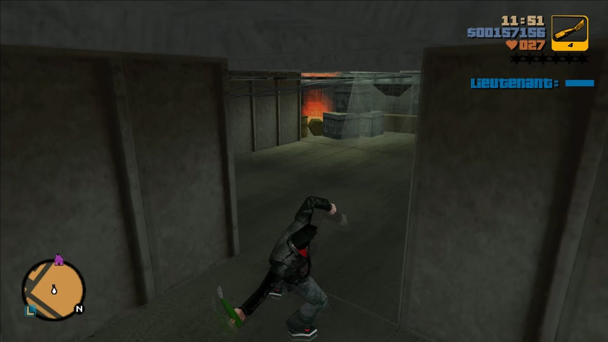
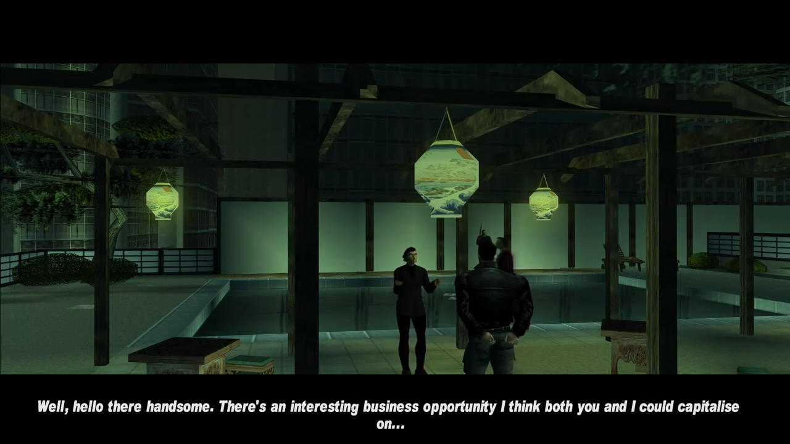
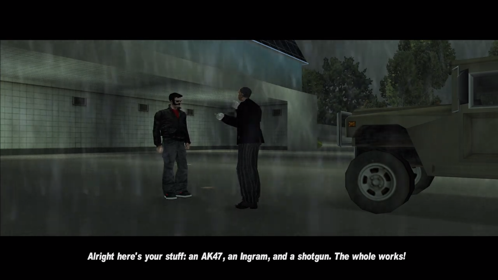

# What is Interception?

**Interception** is a faux-custom mission for Grand Theft Auto III, I say faux-custom mission because it isn't defined via Main.scm, but it emulates the experience of a custom mission 100%, like any CLEO mission would. 

# Installation
Playing **Interception** requires the CLEO library for Grand Theft Auto III, you can get it here (https://cleo.li)
- Drag and drop the contents of the archive to your CLEO folder.
- Head to the marker in Staunton by Kenji's casino to play the mission.

# What knowledge can I get out of this?
- This mission shows how a healthbar can be successfully implemented for a boss fight in Grand Theft Auto: III.
- This mission also shows you how to implement fixed and smooth transitional cameras.
- **Interception** also demonstrates failure conditions, and how to emulate the experience of a mission via cutscenes, fade-in/fade-out and the correct lettering styles. 
- A lot of Grand Theft Auto: III opcodes and operations are interchangable with Grand Theft Auto: Vice City.
- Demonstrates how special actors are loaded and removed.
- Source code shows you how to use various vital CLEO techniques.

# Decompiling the code
The code can be decompiled with Sanny Builder. 

# Screenshots

